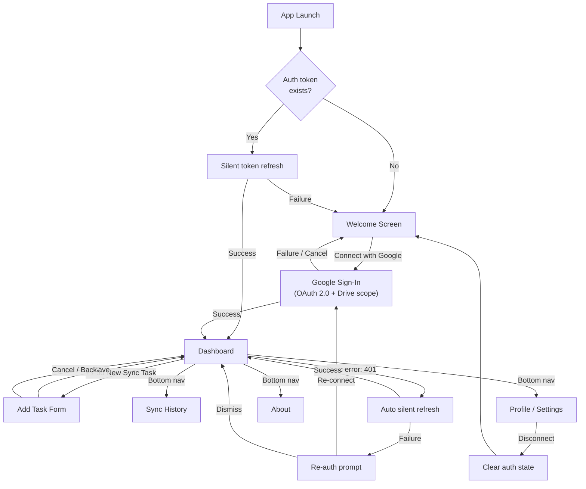
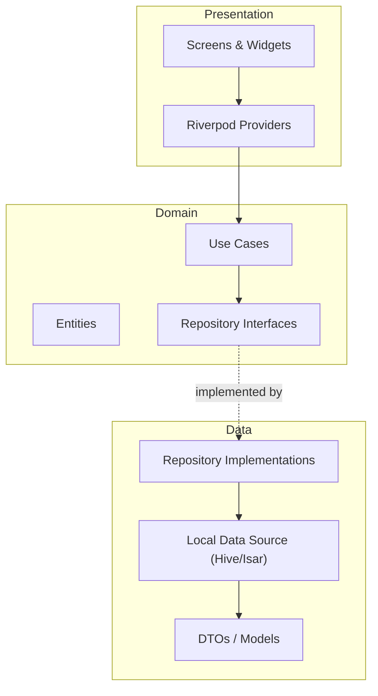

# FolderSync — Architecture & Implementation Plan

---

## 1. Requirements & Scope

### 1.1 Product Overview

FolderSync is a **mobile-first Android app** that lets users create "sync tasks" — each task pairs a **remote cloud folder** (e.g. Google Drive) with a **local Android folder** and keeps them synchronised automatically or on-demand. Think of it as a personal, configurable folder backup / sync tool.

### 1.2 Screens from Stitch

The Stitch project **"Folder Sync App"** (ID `14111882096883368259`) defines the following visible screens:

````carousel

<!-- slide -->

<!-- slide -->

<!-- slide -->

````

### 1.3 User Journeys



| Journey | Description |
|---|---|
| **First-time user** | App launch → no token → Welcome → "Connect with Google" → OAuth → Dashboard. |
| **Returning user (valid)** | App launch → token found → silent refresh succeeds → Dashboard. |
| **Returning user (expired)** | App launch → token found → silent refresh fails → Welcome with re-connect. |
| **Mid-session expiry** | API call hits 401 → auto silent refresh → if succeeds, retry transparently; if fails, in-app re-auth prompt. |
| **Disconnect** | Profile/Settings → "Disconnect Google Account" → auth cleared → Welcome. |
| **Post task creation** | Add Task → save → back to Dashboard with new task visible. |

### 1.4 Functional Requirements

Derived from the Stitch screens and our discussion:

| # | Requirement | Stitch Screen | Priority |
|---|---|---|---|
| **FR-0** | **Welcome / Onboarding** — shown to first-time users or users with no Google account connected. Displays app branding, value proposition, Terms of Service & Privacy Policy consent, and a "Connect with Google" CTA. | Welcome | P0 |
| **FR-0a** | **Google Auth Flow** — OAuth 2.0 via `google_sign_in`. Request `drive.file` scope. Persist tokens locally. Handle silent refresh for returning users. | — | P0 |
| **FR-0b** | **Auth Guard** — GoRouter redirect: no valid session → Welcome; valid → Dashboard. | — | P0 |
| **FR-0c** | **Mid-session Re-auth** — on 401 from any Drive API call, **first** attempt a silent token refresh automatically. If refresh succeeds, retry the failed operation transparently. If refresh fails, display an in-app re-auth prompt. | — | P0 |
| **FR-1** | **Dashboard** — header with app branding + settings icon. **Drive Connection card** showing connected Google account (name, email) and Drive storage usage bar. Below: scrollable list of sync task cards with **real-time status updates**. | Dashboard | P0 |
| **FR-2** | **Sync Task Card** — each card shows: task name, remote path icon+label, local path icon+label, status badge (`Syncing` / `Up to Date` / `Error`), progress bar (when syncing), an edit button, and an optional 2-Way badge. | Dashboard | P0 |
| **FR-3** | **Add New Sync Task** — form with: remote folder picker (Google Drive API), local Android folder picker, sync frequency selector (On Change / Hourly / Daily), two-way sync toggle. Handles auth errors during folder picking gracefully (triggers FR-0c). Navigates back to Dashboard on save. | Add New Sync Task | P0 |
| **FR-3a** | **File Versioning & Auto Conflict Resolution** — see §1.5 below for detailed strategy. | — | P0 |
| **FR-4** | **Sync History** — chronological list of file-level sync events (filename, parent task, timestamp, status icon). No filtering for v1. | History | P0 |
| **FR-5** | **Bottom Navigation** — four tabs: Tasks (home/dashboard), History, Profile, About. | All screens | P0 |
| **FR-6** | **Edit Sync Task** — edit an existing task's settings (reuse Add Task form). | Dashboard (edit button) | P1 |
| **FR-7** | **Delete Sync Task** — swipe or menu action to remove a task. | — | P1 |
| **FR-8** | **Profile / Settings screen** — connected Google account info, **Disconnect Google Account** action (clears auth → Welcome screen). Minimal for v1. | — | P0 |
| **FR-9** | **About screen** — app version, links. | — | P2 |

### 1.5 File Versioning & Conflict Resolution Strategy

**Approach: Last-Write-Wins (LWW) with version history safety net.**

When a conflict is detected (file changed on both local and remote since last sync):
1. Compare `lastModifiedTimestamp` of local file vs. remote file.
2. The **most recently modified** version wins and becomes the current file.
3. The "losing" version is **saved to version history** (never discarded).
4. User can browse version history and **rollback** to any previous version.

> [!WARNING]
> **Implications to be aware of:**
>
> | Concern | Impact | Mitigation |
> |---|---|---|
> | **Data loss perception** | User edits on the "older" side are overwritten automatically | Losing version always preserved in history → user can rollback |
> | **Clock skew** | Device clock and Google Drive server clock may differ, causing wrong winner | Use Google Drive API’s `modifiedTime` (server-authoritative) for remote; `File.lastModified()` for local. Both are UTC. |
> | **Rapid edits** | Two near-simultaneous edits may pick an arbitrary winner | For v1 (single user, single device), this is extremely unlikely. Multi-device support can add a merge UI later. |
> | **Storage growth** | Version history accumulates over time | Cap at N versions per file (e.g., 10) with oldest auto-pruned |
>
> **Why LWW is right for v1:** FolderSync is a single-user, single-device app. The user is the only editor, so true conflicts (both sides changed independently) are rare. When they do happen, auto-resolve + version history gives a fast, safe default with zero friction.

### 1.6 Non-Functional Requirements

| # | Requirement | Notes |
|---|---|---|
| **NFR-1** | **Android first** | Initial target. Architecture should not preclude iOS / desktop later. |
| **NFR-2** | **Client-side only (Phase 1)** | No backend server; all data persisted locally. Google Drive access via client-side OAuth + Drive API. Background sync via **WorkManager**. |
| **NFR-3** | **Scalable architecture** | Feature-first + clean architecture layers to support future additions. |
| **NFR-4** | **Offline capable** | Primary operations must work without network; sync queues up. |
| **NFR-5** | **Responsive & performant** | 60fps scrolling, < 2s cold start. |
| **NFR-6** | **Secure auth** | OAuth tokens stored securely via `flutter_secure_storage`. No passwords stored. |

### 1.7 Scope Boundaries (v1 vs. Future)

| In scope (v1) | Out of scope (future) |
|---|---|
| **Google Sign-In + OAuth 2.0** (Drive scope) | Multi-cloud providers (OneDrive, Dropbox) |
| Welcome / onboarding + auth guard + **auto re-auth** | Server-side auth service |
| **Disconnect** via Profile / Settings screen | Push notifications for sync status |
| **Drive Connection card** (status + storage) | Dark mode toggle |
| Local task CRUD with persistence | iOS / desktop builds |
| Background sync via **WorkManager** | Edit/Delete sync tasks (P1) |
| **Real-time status updates** on dashboard | — |
| **LWW conflict resolution** + version history | Manual merge UI |
| Sync history (no filtering) | History filtering (P1+) |
| Light mode · Android only | — |

---

## 2. Design System (from Stitch)

Extracted from the Stitch project's `designTheme`:

| Token | Value |
|---|---|
| **Primary colour** | `#FFB247` (warm amber) |
| **Background (light)** | `#F8F7F5` |
| **Background (dark)** | `#231B0F` |
| **Font family** | **Roboto Flex** (variable weight 100–900) |
| **Border radius** | `8px` default (`ROUND_EIGHT`) |
| **Color mode** | Light (initial) |
| **Icon set** | Material Symbols Outlined |
| **Status colours** | Blue (Syncing), Green (Up to Date), Red (Error), Amber (Primary / 2-Way badge) |

---

## 3. Guiding Architecture Principles

| Principle | What it means for FolderSync |
|---|---|
| **Feature-first structure** | Code organised by feature (`sync_tasks`, `history`, …), not by type. |
| **Clean Architecture layers** | Every feature contains `data → domain → presentation` layers. |
| **Dependency Inversion** | Domain layer depends on nothing else; data & presentation depend on domain through abstract interfaces. |
| **Single Responsibility** | One class = one reason to change. |
| **Testability** | Every layer independently testable; repository interfaces make mocking trivial. |

---

## 4. Folder Structure

```
lib/
├── app/                          # App-wide configuration
│   ├── app.dart                  # MaterialApp / root widget
│   ├── router.dart               # GoRouter config + auth redirect
│   └── theme.dart                # ThemeData from Stitch design system
│
├── core/                         # Shared utilities & base classes
│   ├── constants/
│   ├── errors/
│   ├── extensions/
│   ├── services/                 # Platform services (file system, permissions)
│   └── utils/
│
├── features/
│   ├── auth/                     # FR-0, FR-0a, FR-0b
│   │   ├── data/
│   │   │   ├── datasources/      # google_sign_in wrapper
│   │   │   └── repositories/
│   │   ├── domain/
│   │   │   ├── entities/         # AuthUser
│   │   │   ├── repositories/     # AuthRepository interface
│   │   │   └── usecases/         # SignIn, SignOut, GetCurrentUser
│   │   └── presentation/
│   │       ├── providers/        # authStateProvider, signInProvider
│   │       └── screens/          # welcome_screen
│   │
│   ├── sync_tasks/               # FR-1, FR-2, FR-3
│   │   ├── data/
│   │   │   ├── datasources/
│   │   │   ├── models/
│   │   │   └── repositories/
│   │   ├── domain/
│   │   │   ├── entities/
│   │   │   ├── repositories/
│   │   │   └── usecases/
│   │   └── presentation/
│   │       ├── providers/
│   │       ├── screens/          # dashboard_screen, add_task_screen
│   │       └── widgets/          # sync_task_card, drive_connection_card
│   │
│   ├── history/                  # FR-4
│   │   ├── data/ …
│   │   ├── domain/ …
│   │   └── presentation/
│   │       ├── screens/          # history_screen
│   │       └── widgets/          # history_item, filter_chips
│   │
│   ├── profile/                  # FR-8 (P0 — disconnect)
│   │   └── presentation/screens/
│   │
│   └── about/                    # FR-9
│       └── presentation/screens/
│
├── shared/
│   └── widgets/                  # bottom_nav_bar, app_scaffold
│
└── main.dart
```

---

## 5. Architecture Diagram



---

## 6. State Management: Riverpod (Recommended)

> [!NOTE]
> **Why Riverpod over Bloc?** For FolderSync's needs — a task-list-centric app with CRUD + status updates — Riverpod is the better fit:
> - **Less boilerplate**: No event/state classes per feature. A single `AsyncNotifierProvider` replaces Bloc + Event + State.
> - **Compile-safe DI**: Providers are global, typed, and auto-disposed. No `BlocProvider` tree to manage.
> - **Code-gen support**: `riverpod_annotation` + `riverpod_generator` further reduces boilerplate.
> - **Fine-grained rebuilds**: `ref.watch` rebuilds only the widgets that depend on changed state.
> - **Simpler testing**: Override any provider in tests without a widget tree.
>
> Bloc shines in very large teams with strict event-driven auditing needs — which doesn't apply here yet.

### Strategy
- Each feature exposes **providers** that hold its state.
- Providers call **use-cases** → use-cases call **repository interfaces**.
- `AsyncValue<T>` for loading / error / data states throughout.
- Global app-level state (theme mode) lives in `app/` providers.

---

## 7. Technology & Package Choices

| Concern | Choice | Rationale |
|---|---|---|
| **Authentication** | `google_sign_in`, `flutter_secure_storage` | Native Google Sign-In + secure token storage. |
| **Google Drive API** | `googleapis`, `googleapis_auth` | Official Dart client for Drive v3 API. |
| **State management** | `flutter_riverpod` + `riverpod_annotation` | See §6 above. |
| **Navigation** | `go_router` | Declarative, deep-link friendly, auth redirect. |
| **Local storage** | `hive` (`hive_flutter`) | Fast KV store, no native deps, works offline. |
| **Background sync** | `workmanager` | Android WorkManager integration for reliable background tasks. |
| **File system** | `path_provider` + `dart:io` | Standard; abstracted behind a service interface. |
| **Code generation** | `build_runner`, `freezed`, `json_serializable` | Immutable models, union types, JSON mapping. |
| **Linting** | `flutter_lints` | Strict rule set from day one. |
| **Icons/Font** | `google_fonts` (Roboto Flex), Material Symbols | Match Stitch design. |

---

## 8. Scalability Path

| Future need | How the architecture accommodates it |
|---|---|
| **Multi-cloud** | Strategy pattern in data layer — one `DataSource` per provider behind the same repository interface. |
| **Notifications** | New `notifications` feature + `NotificationService` in core. |
| **File versioning** | `VersionRepository` in `sync_tasks/data` stores file snapshots + metadata; use-case resolves conflicts via timestamp/hash comparison. |

---

## 9. Proposed Scaffold (Phase 1)

### App Shell
- [NEW] `lib/main.dart` — entry point, `ProviderScope`, `runApp`
- [NEW] `lib/app/app.dart` — `MaterialApp.router` with Stitch theme
- [NEW] `lib/app/router.dart` — GoRouter with auth redirect + bottom nav routes
- [NEW] `lib/app/theme.dart` — `ThemeData` from §2 design system

### Core
- [NEW] `lib/core/constants/app_constants.dart`
- [NEW] `lib/core/errors/failures.dart`

### Shared Widgets
- [NEW] `lib/shared/widgets/bottom_nav_bar.dart`

### Feature: Auth (P0)
- [NEW] `lib/features/auth/presentation/screens/welcome_screen.dart`
- [NEW] `lib/features/auth/presentation/providers/auth_provider.dart`
- [NEW] `lib/features/auth/domain/entities/auth_user.dart`
- [NEW] `lib/features/auth/domain/repositories/auth_repository.dart`
- [NEW] `lib/features/auth/domain/usecases/sign_in.dart`
- [NEW] `lib/features/auth/data/datasources/google_auth_datasource.dart`
- [NEW] `lib/features/auth/data/repositories/auth_repository_impl.dart`

### Feature: Sync Tasks (P0)
- [NEW] `lib/features/sync_tasks/presentation/screens/dashboard_screen.dart`
- [NEW] `lib/features/sync_tasks/presentation/screens/add_task_screen.dart`
- [NEW] `lib/features/sync_tasks/presentation/widgets/sync_task_card.dart`
- [NEW] `lib/features/sync_tasks/presentation/widgets/drive_connection_card.dart`
- [NEW] `lib/features/sync_tasks/domain/entities/sync_task.dart`
- [NEW] `lib/features/sync_tasks/domain/repositories/sync_task_repository.dart`
- [NEW] `lib/features/sync_tasks/data/models/sync_task_model.dart`
- [NEW] `lib/features/sync_tasks/data/datasources/sync_task_local_datasource.dart`
- [NEW] `lib/features/sync_tasks/data/repositories/sync_task_repository_impl.dart`

### Feature: History (P0)
- [NEW] `lib/features/history/presentation/screens/history_screen.dart`
- [NEW] `lib/features/history/presentation/widgets/history_item.dart`

### Placeholder Tabs (P2 — minimal)
- [NEW] `lib/features/profile/presentation/screens/profile_screen.dart`
- [NEW] `lib/features/about/presentation/screens/about_screen.dart`

### Config
- [MODIFY] `pubspec.yaml` — add all dependencies listed in §7

---

## 10. Verification Plan

### Automated
```bash
flutter analyze
flutter test
```

### Manual
1. `flutter run` on Android emulator → confirm app launches with Stitch theme
2. Verify bottom nav switches between all 4 tabs
3. Confirm hot-reload works without errors
