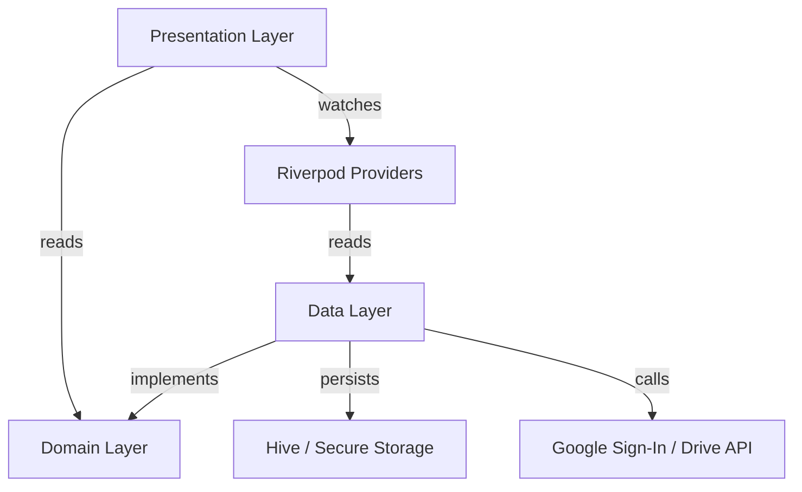

# FolderSync — Scaffold Walkthrough

## Summary

Fully scaffolded Flutter project for **FolderSync** with feature-first clean architecture, all screens wired to Riverpod providers, Hive-backed persistence, Google Sign-In auth flow, and GoRouter auth guard. **`flutter analyze` passes with 0 issues.**

## Verification

```
$ flutter analyze
Analyzing folder-sync-app...
No issues found! (ran in 0.9s)
```

## Architecture



## Project Structure (26 Dart files)

```
lib/
├── main.dart                                    ← Hive init + ProviderScope
├── app/
│   ├── app.dart                                 ← MaterialApp.router
│   ├── router.dart                              ← GoRouter + auth guard + refresh
│   └── theme.dart                               ← Stitch design system
├── core/
│   ├── constants/app_constants.dart              ← Scopes, version cap
│   └── errors/
│       ├── failures.dart                         ← Sealed failure hierarchy
│       └── exceptions.dart                       ← Data layer exceptions
├── shared/
│   ├── providers/app_providers.dart              ← All Riverpod providers
│   └── widgets/bottom_nav_shell.dart             ← 4-tab bottom nav
└── features/
    ├── auth/
    │   ├── domain/
    │   │   ├── entities/auth_user.dart
    │   │   ├── repositories/auth_repository.dart
    │   │   └── usecases/auth_usecases.dart
    │   ├── data/repositories/auth_repository_impl.dart  ← Google Sign-In
    │   └── presentation/screens/welcome_screen.dart     ← FR-0
    ├── sync_tasks/
    │   ├── domain/
    │   │   ├── entities/sync_task.dart
    │   │   ├── repositories/sync_task_repository.dart
    │   │   └── usecases/sync_task_usecases.dart
    │   ├── data/
    │   │   ├── models/sync_task_model.dart               ← JSON ↔ Hive
    │   │   └── repositories/sync_task_repository_impl.dart
    │   └── presentation/
    │       ├── screens/dashboard_screen.dart              ← FR-1
    │       ├── screens/add_task_screen.dart               ← FR-3
    │       └── widgets/
    │           ├── drive_connection_card.dart             ← FR-1
    │           └── sync_task_card.dart                    ← FR-2
    ├── history/
    │   ├── domain/
    │   │   ├── entities/sync_history_entry.dart
    │   │   └── repositories/sync_history_repository.dart
    │   ├── data/
    │   │   ├── models/sync_history_model.dart
    │   │   └── repositories/sync_history_repository_impl.dart
    │   └── presentation/screens/history_screen.dart       ← FR-4
    ├── profile/presentation/screens/profile_screen.dart   ← FR-8 (disconnect)
    └── about/presentation/screens/about_screen.dart       ← FR-9
```

## Key Flows Implemented

| Flow | How it works |
|---|---|
| **Sign-in** | Welcome → `AuthNotifier.signIn()` → `google_sign_in` OAuth → token stored in secure storage → auth guard redirects to Dashboard |
| **Silent refresh** | App launch → `AuthNotifier.build()` calls `silentRefresh()` → if token valid, Dashboard; if not, Welcome |
| **Auth guard** | `router.dart` watches `authStateProvider` → redirects unauthenticated users to Welcome, authenticated users away from Welcome |
| **Disconnect** | Profile → confirm dialog → `AuthNotifier.signOut()` → clears secure storage → auth guard redirects to Welcome |
| **Create task** | AddTask form → validates → `SyncTaskRepository.createTask()` → Hive persist → invalidates stream → Dashboard refreshes |
| **Live dashboard** | `syncTasksStreamProvider` watches Hive box changes → Dashboard rebuilds automatically |
| **History** | `syncHistoryStreamProvider` watches Hive box → live list with clear-all confirmation |

## Dependencies

| Package | Version | Purpose |
|---|---|---|
| `flutter_riverpod` | ^2.6.1 | State management |
| `go_router` | ^14.8.1 | Navigation + auth guard |
| `google_sign_in` | ^6.2.2 | Google OAuth |
| `googleapis` / `googleapis_auth` | ^13.2.0 / ^1.6.0 | Drive API |
| `flutter_secure_storage` | ^9.2.4 | Secure token persistence |
| `hive` / `hive_flutter` | ^2.2.3 / ^1.1.0 | Local data persistence |
| `workmanager` | ^0.5.2 | Background sync (not yet wired) |
| `google_fonts` | ^6.2.1 | Roboto Flex font |
| `freezed` / `json_serializable` | ^2.5.8 / ^6.9.4 | Model codegen (available) |

## What's Next

The scaffold is fully functional with placeholder folder pickers. Remaining implementation for production:

1. **Google Drive folder picker** — use `googleapis` Drive API to browse and select remote folders
2. **Local folder picker** — use Android's SAF (Storage Access Framework) or `file_picker`
3. **Actual sync engine** — file comparison, download/upload, LWW conflict resolution
4. **WorkManager integration** — schedule periodic background sync jobs
5. **Drive storage quota** — fetch real quota via Drive API `about.get()`
6. **Version history UI** — browse and rollback file versions
